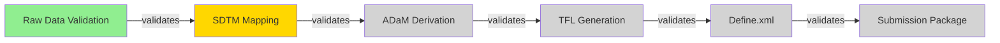

# Workflow Graph Implementation Plan

## Overview

This document proposes extending csp-workflow-engine's existing knowledge graph architecture to create a **Workflow Enforcement Engine** that:

1. **Encodes workflows as first-class graph nodes** with typed dependencies
2. **Routes skills based on workflow position** (narrowing search space)
3. **Enforces validation gates between stages** via property triggers
4. **Provides real-time progress visualization** through graph traversal

---

## Architecture

### Core Concept: Workflow as Graph

```
┌─────────────────────────────────────────────────────────────────┐
│                    WORKFLOW GRAPH LAYER                         │
├─────────────────────────────────────────────────────────────────┤
│                                                                  │
│   ┌──────────┐    requires    ┌──────────┐    requires         │
│   │  Stage 1 │ ──────────────▶│  Stage 2 │ ──────────────▶     │
│   │ SDTM     │                │ ADaM     │                     │
│   │ Mapping  │                │ Derive   │                     │
│   └────┬─────┘                └────┬─────┘                     │
│        │                           │                            │
│        │ validates                │ validates                  │
│        ▼                           ▼                            │
│   ┌──────────┐                ┌──────────┐                     │
│   │ Gate:    │                │ Gate:    │                     │
│   │ P21 Val  │                │ Spec Val │                     │
│   └──────────┘                └──────────┘                     │
│                                                                  │
├─────────────────────────────────────────────────────────────────┤
│                    SKILL ROUTING LAYER                          │
├─────────────────────────────────────────────────────────────────┤
│                                                                  │
│   skills_allowed: [/sdtm-mapper, /sdtm-validator, /p21-check]  │
│   skills_blocked: [/adam-derive, /tfl-generate, /define-export]│
│                                                                  │
└─────────────────────────────────────────────────────────────────┘
```

---

## File Structure

### New Files to Create

```
csp-workflow-engine/
├── skill-sources/
│   └── workflow/
│       ├── skill.json
│       └── SKILL.md              # /workflow command
│
├── generators/
│   └── features/
│       └── workflow-graph.md     # Feature block for context file
│
├── hooks/
│   └── scripts/
│       ├── workflow-enforce.sh   # Workflow validation hook
│       └── workflow-orient.sh    # Session workflow state injection
│
├── reference/
│   └── workflow-schema.yaml      # Workflow schema definition
│
└── templates/
    └── workflows/
        ├── sdtm-to-submission.yaml
        └── feature-development.yaml
```

### Files to Extend

| File | Extension |
|------|-----------|
| `hooks/hooks.json` | Add `workflow-enforce.sh` to PostToolUse |
| `skill-sources/ralph/SKILL.md` | Add workflow-aware phase gates |
| `skill-sources/next/SKILL.md` | Add workflow state to signals |
| `reference/kernel.yaml` | Add `workflow-graph` primitive |

---

## Implementation Details

### 1. Workflow Schema (YAML)

**File:** `reference/workflow-schema.yaml`

```yaml
schema_version: 1
workflow_schema:
  # Workflow definition
  workflow:
    type: object
    required: [id, name, stages]
    properties:
      id:
        type: string
        description: "Unique workflow identifier"
      name:
        type: string
        description: "Human-readable workflow name"
      description:
        type: string
        description: "What this workflow accomplishes"
      stages:
        type: array
        items:
          $ref: "#/stage_schema"

  # Stage definition
  stage_schema:
    type: object
    required: [id, name, skills_allowed]
    properties:
      id:
        type: string
        description: "Unique stage identifier"
      name:
        type: string
        description: "Human-readable stage name"
      sequence:
        type: integer
        description: "Order in workflow (0-indexed)"
      description:
        type: string
        description: "What happens in this stage"
      skills_allowed:
        type: array
        items:
          type: string
        description: "Skills that can be used in this stage"
      skills_blocked:
        type: array
        items:
          type: string
        description: "Skills explicitly blocked in this stage"
      dependencies:
        type: array
        items:
          type: string
        description: "Stage IDs that must complete before this stage"
      validation_gates:
        type: array
        items:
          $ref: "#/gate_schema"
      outputs:
        type: array
        items:
          type: object
          properties:
            artifact_type:
              type: string
            format:
              type: string
            required_for:
              type: array
              items:
                type: string
      exit_conditions:
        type: array
        items:
          type: object
          properties:
            condition:
              type: string
            action:
              type: string
              enum: [advance, block, escalate]

  # Validation gate definition
  gate_schema:
    type: object
    required: [id, skill, pass_condition]
    properties:
      id:
        type: string
      skill:
        type: string
        description: "Skill to invoke for validation"
      pass_condition:
        type: string
        description: "Expression that must evaluate to true"
      failure_action:
        type: string
        enum: [block, warn, escalate]
        default: block
      auto_run:
        type: boolean
        default: false
        description: "Run automatically when stage outputs change"
```

### 2. Workflow State File

**File:** `ops/workflow-state.yaml` (generated in user's vault)

```yaml
schema_version: 1
workflow:
  id: sdtm-to-submission
  name: "SDTM to Submission Package"
  current_stage: sdtm-mapping
  started: "2026-03-16T10:00:00Z"

stages:
  - id: raw-data-validation
    status: completed
    completed_at: "2026-03-15T14:30:00Z"
    outputs:
      - path: data/raw/validated/
        artifact_type: dataset

  - id: sdtm-mapping
    status: in_progress
    started_at: "2026-03-16T10:00:00Z"
    validation_results:
      - gate_id: p21-compliance
        status: pending
        last_run: null
    outputs: []

  - id: adam-derivation
    status: blocked
    blocked_by: [sdtm-mapping]

  - id: tfl-generation
    status: blocked
    blocked_by: [adam-derivation]

  - id: define-xml
    status: blocked
    blocked_by: [tfl-generation]

  - id: submission-package
    status: blocked
    blocked_by: [define-xml]

metrics:
  total_stages: 6
  completed_stages: 1
  blocked_stages: 4
  estimated_completion: null
```

### 3. Workflow Skill (SKILL.md)

**File:** `skill-sources/workflow/SKILL.md`

```markdown
---
name: workflow
description: Manage workflow execution, stage transitions, and validation gates. Routes skills based on current workflow position. Triggers on "/workflow", "/workflow status", "/workflow advance", "/workflow gates".
version: "1.0"
generated_from: "csp-workflow-engine-v2.0"
user-invocable: true
context: fork
model: sonnet
allowed-tools: Read, Write, Edit, Grep, Glob, Bash, Task
argument-hint: "[command] — commands: status, advance, gates, skills, graph, init"
---

## EXECUTE NOW

**Target: $ARGUMENTS**

Parse command from arguments:
- `status` — Show current workflow state
- `advance` — Attempt to advance to next stage
- `gates` — Show validation gate status
- `skills` — Show allowed/blocked skills at current stage
- `graph` — Generate Mermaid diagram of workflow
- `init [workflow-id]` — Initialize a new workflow
- No args — Interactive mode

**START NOW.** Execute the appropriate command.

---

## Runtime Configuration (Step 0)

Read these files:
1. `ops/workflow-state.yaml` — Current workflow state
2. `ops/workflows/[workflow-id].yaml` — Workflow definition
3. `ops/derivation-manifest.md` — Domain vocabulary

---

## Commands

### /workflow status

Display current workflow state:

```
--=={ workflow status }==--

Workflow: SDTM to Submission Package
Current Stage: SDTM Mapping (Stage 2/6)
Duration: 2h 30m

Progress:
  ✓ Raw Data Validation (completed)
  ● SDTM Mapping (in progress)
  ○ ADaM Derivation (blocked)
  ○ TFL Generation (blocked)
  ○ Define.xml (blocked)
  ○ Submission Package (blocked)

Validation Gates:
  ● P21 Compliance: PENDING (required to advance)
  ○ SDTM Consistency: NOT RUN

Blocked Actions:
  - /adam-derive (blocked until SDTM Mapping completes)
  - /tfl-generate (blocked until ADaM Derivation completes)

Run /workflow gates to check validation status.
Run /workflow advance when gates pass.
```

### /workflow advance

Attempt to advance to the next stage:

**Step 1: Check Dependencies**

For the current stage, verify all `dependencies` are completed.

**Step 2: Run Validation Gates**

For each gate in `validation_gates`:
1. If `auto_run: true`, execute the validation skill
2. Check `pass_condition`
3. If any gate fails with `failure_action: block`, STOP

**Step 3: Verify Outputs**

Check that all required `outputs` exist.

**Step 4: Transition**

If all checks pass:
1. Mark current stage as `completed`
2. Mark next stage as `in_progress`
3. Update `workflow-state.yaml`

```
--=={ workflow advance }==--

Checking dependencies for: sdtm-mapping
  ✓ raw-data-validation: completed

Running validation gates:
  Running: P21 Compliance Check...
  ✓ P21 Compliance: PASS

Verifying outputs:
  ✓ SDTM datasets generated: 15 files
  ✓ SDTM metadata complete

Stage Transition:
  sdtm-mapping → adam-derivation

Updating workflow state...

New Stage: ADaM Derivation
Skills now available: /adam-derive, /adam-validate, /spec-check
Skills now blocked: /sdtm-mapper (no longer needed)
```

### /workflow gates

Show detailed validation gate status:

```
--=={ workflow gates }==--

Current Stage: SDTM Mapping

Gate 1: P21 Compliance
  Skill: /p21-validator
  Condition: "pinnacle21_pass == true"
  Status: PENDING
  Last Run: Never
  Failure Action: BLOCK
  → Run: /p21-validator

Gate 2: SDTM Consistency
  Skill: /sdtm-consistency-check
  Condition: "no_errors && no_warnings"
  Status: NOT RUN
  Failure Action: WARN
  → Run: /sdtm-consistency-check

To advance, run all BLOCK gates until they pass.
```

### /workflow skills

Show skill routing based on workflow position:

```
--=={ workflow skills }==--

Current Stage: SDTM Mapping

ALLOWED Skills (5):
  /sdtm-mapper       — Map raw data to SDTM domains
  /sdtm-validator    — Validate SDTM compliance
  /p21-check         — Pinnacle 21 validation
  /data-quality      — Data quality checks
  /spec-import       — Import specifications

BLOCKED Skills (12):
  /adam-derive       — Blocked: requires SDTM completion
  /tfl-generate      — Blocked: requires ADaM completion
  /define-export     — Blocked: requires TFL completion
  ... (9 more)

Why blocked? Run /workflow graph to see dependencies.
```

### /workflow graph

Generate Mermaid diagram:



### /workflow init [workflow-id]

Initialize a workflow from template:

**Step 1:** Check if `ops/workflows/` exists
**Step 2:** Copy template from `templates/workflows/[workflow-id].yaml`
**Step 3:** Create `ops/workflow-state.yaml`
**Step 4:** Run initial stage setup

---

## Integration Points

### With /ralph

The RALPH orchestration checks workflow state before processing:

```yaml
# In /ralph, before spawning subagent:
workflow_check:
  if: current_skill in workflow.current_stage.skills_blocked
  action: block with explanation
  message: "Skill {skill} is blocked at current stage. Complete {current_stage} first."
```

### With /next

The /next skill includes workflow state in signals:

```yaml
# In /next signals:
workflow_signals:
  - stage_blocked: "Stage {id} has been in_progress for {duration}"
  - gates_pending: "{N} validation gates pending for current stage"
  - skills_limited: "Only {N} skills available at current stage"
```

### With Hooks

The workflow-enforce.sh hook validates on Write:

```bash
# Check if file affects workflow outputs
if file_matches_stage_output "$FILE_PATH"; then
  # Mark validation gates as stale
  update_gate_status "pending"
fi
```

---

## Quality Gates

### Gate 1: Stage Transition Validation

Before any stage transition:
- All `validation_gates` with `failure_action: block` must pass
- All `dependencies` must have `status: completed`
- All required `outputs` must exist

### Gate 2: Skill Routing Enforcement

Before any skill execution:
- Check `skills_allowed` for current stage
- Check `skills_blocked` for current stage
- Block with explanation if skill is not allowed

### Gate 3: State Persistence

After any state change:
- Write to `ops/workflow-state.yaml`
- Log transition in `ops/workflow-log.md`

---

## Critical Constraints

**Never:**
- Allow skill execution that's in `skills_blocked`
- Advance stage with failing BLOCK gates
- Skip dependencies
- Modify workflow state without logging

**Always:**
- Check workflow state at session start
- Run validation gates before stage advance
- Log all state transitions
- Explain why skills are blocked
```

### 4. Workflow Hook Script

**File:** `hooks/scripts/workflow-enforce.sh`

```bash
#!/bin/bash
# workflow-enforce.sh
# Validates workflow constraints on file writes

set -e

# Read stdin for hook input
INPUT=$(cat)
FILE_PATH=$(echo "$INPUT" | jq -r '.tool_input.file_path // empty')

# Guard: Check if this is a vault
if [ ! -f ".csp-workflow" ]; then
  echo '{"additionalContext": ""}'
  exit 0
fi

# Guard: Check if workflow is active
if [ ! -f "ops/workflow-state.yaml" ]; then
  echo '{"additionalContext": ""}'
  exit 0
fi

# Get current workflow state
CURRENT_STAGE=$(grep "current_stage:" ops/workflow-state.yaml | cut -d: -f2 | tr -d ' ')

# Check if file is a workflow output
IS_OUTPUT=false
if grep -q "$FILE_PATH" "ops/workflows/*.yaml" 2>/dev/null; then
  IS_OUTPUT=true
fi

# If file is an output, invalidate validation gates
if [ "$IS_OUTPUT" = true ]; then
  # Mark gates as pending
  if command -v yq &> /dev/null; then
    yq -i '.stages[] | select(.id == "'$CURRENT_STAGE'") | .validation_results[].status = "pending"' ops/workflow-state.yaml
  fi

  cat <<EOF
{"additionalContext": "⚠️ Workflow output modified. Validation gates reset to PENDING. Run /workflow gates to re-validate."}
EOF
  exit 0
fi

# Default: no workflow context
echo '{"additionalContext": ""}'
```

### 5. Workflow Orient Script

**File:** `hooks/scripts/workflow-orient.sh`

```bash
#!/bin/bash
# workflow-orient.sh
# Injects workflow state at session start

set -e

# Guard: Check if workflow is active
if [ ! -f "ops/workflow-state.yaml" ]; then
  exit 0
fi

# Read workflow state
WORKFLOW_ID=$(grep "id:" ops/workflow-state.yaml | head -1 | cut -d: -f2 | tr -d ' ')
CURRENT_STAGE=$(grep "current_stage:" ops/workflow-state.yaml | cut -d: -f2 | tr -d ' ')

# Count pending gates
PENDING_GATES=$(grep -c "status: pending" ops/workflow-state.yaml 2>/dev/null || echo "0")

# Generate workflow context
cat <<EOF

--=={ Workflow: $WORKFLOW_ID }==--
Current Stage: $CURRENT_STAGE
Pending Gates: $PENDING_GATES

Run /workflow status for details.
EOF
```

### 6. SDTM to Submission Workflow Template

**File:** `templates/workflows/sdtm-to-submission.yaml`

```yaml
id: sdtm-to-submission
name: "SDTM to Submission Package"
description: "Complete clinical trial statistical programming workflow from raw data to regulatory submission"

stages:
  - id: raw-data-validation
    name: "Raw Data Validation"
    sequence: 0
    description: "Validate incoming raw data against specifications"
    skills_allowed:
      - /data-import
      - /data-validator
      - /spec-check
      - /quality-report
    skills_blocked:
      - /sdtm-mapper
      - /adam-derive
      - /tfl-generate
    dependencies: []
    validation_gates:
      - id: raw-data-complete
        skill: /data-validator
        pass_condition: "all_datasets_present && all_variables_mapped"
        failure_action: block
        auto_run: true
    outputs:
      - artifact_type: dataset
        format: raw
        required_for: [sdtm-mapping]

  - id: sdtm-mapping
    name: "SDTM Mapping"
    sequence: 1
    description: "Map raw data to CDISC SDTM standards"
    skills_allowed:
      - /sdtm-mapper
      - /sdtm-validator
      - /p21-check
      - /domain-mapper
      - /spec-import
      - /data-quality
    skills_blocked:
      - /adam-derive
      - /tfl-generate
      - /define-export
    dependencies: [raw-data-validation]
    validation_gates:
      - id: p21-compliance
        skill: /p21-validator
        pass_condition: "pinnacle21_pass == true"
        failure_action: block
        auto_run: true
      - id: sdtm-consistency
        skill: /sdtm-consistency-check
        pass_condition: "no_errors && no_warnings"
        failure_action: warn
        auto_run: false
    outputs:
      - artifact_type: dataset
        format: sdtm
        required_for: [adam-derivation]
      - artifact_type: metadata
        format: define-xml-partial
        required_for: [define-xml]

  - id: adam-derivation
    name: "ADaM Derivation"
    sequence: 2
    description: "Create analysis datasets from SDTM"
    skills_allowed:
      - /adam-derive
      - /adam-validator
      - /spec-mapper
      - /derivation-builder
    skills_blocked:
      - /sdtm-mapper
      - /tfl-generate
    dependencies: [sdtm-mapping]
    validation_gates:
      - id: adam-compliance
        skill: /adam-validator
        pass_condition: "adam_compliant && all_params_derived"
        failure_action: block
        auto_run: true
    outputs:
      - artifact_type: dataset
        format: adam
        required_for: [tfl-generation]

  - id: tfl-generation
    name: "TFL Generation"
    sequence: 3
    description: "Generate tables, figures, and listings"
    skills_allowed:
      - /tfl-generate
      - /tfl-validate
      - /report-builder
      - /shell-mapper
    skills_blocked:
      - /sdtm-mapper
      - /adam-derive
    dependencies: [adam-derivation]
    validation_gates:
      - id: tfl-complete
        skill: /tfl-validator
        pass_condition: "all_shells_filled && qc_passed"
        failure_action: block
        auto_run: false
    outputs:
      - artifact_type: report
        format: rtf
        required_for: [submission-package]
      - artifact_type: report
        format: pdf
        required_for: [submission-package]

  - id: define-xml
    name: "Define.xml Generation"
    sequence: 4
    description: "Create regulatory submission metadata"
    skills_allowed:
      - /define-export
      - /define-validator
      - /metadata-builder
    skills_blocked:
      - /sdtm-mapper
      - /adam-derive
      - /tfl-generate
    dependencies: [tfl-generation]
    validation_gates:
      - id: define-valid
        skill: /define-validator
        pass_condition: "schema_valid && all_references_resolved"
        failure_action: block
        auto_run: true
    outputs:
      - artifact_type: metadata
        format: define-xml
        required_for: [submission-package]

  - id: submission-package
    name: "Submission Package Assembly"
    sequence: 5
    description: "Assemble final regulatory submission package"
    skills_allowed:
      - /package-assemble
      - /submission-validator
      - /archive-builder
    skills_blocked: []
    dependencies: [define-xml]
    validation_gates:
      - id: submission-ready
        skill: /submission-validator
        pass_condition: "all_components_present && all_validations_pass"
        failure_action: block
        auto_run: true
    outputs:
      - artifact_type: package
        format: regulatory-submission
        required_for: []
```

---

## Integration with Existing Components

### Extended hooks.json

```json
{
  "hooks": {
    "SessionStart": [
      {
        "hooks": [
          {
            "type": "command",
            "command": "${CLAUDE_PLUGIN_ROOT}/hooks/scripts/session-orient.sh",
            "timeout": 10
          },
          {
            "type": "command",
            "command": "${CLAUDE_PLUGIN_ROOT}/hooks/scripts/workflow-orient.sh",
            "timeout": 5
          }
        ]
      }
    ],
    "PostToolUse": [
      {
        "matcher": "Write",
        "hooks": [
          {
            "type": "command",
            "command": "${CLAUDE_PLUGIN_ROOT}/hooks/scripts/write-validate.sh",
            "timeout": 5
          },
          {
            "type": "command",
            "command": "${CLAUDE_PLUGIN_ROOT}/hooks/scripts/workflow-enforce.sh",
            "timeout": 3
          },
          {
            "type": "command",
            "command": "${CLAUDE_PLUGIN_ROOT}/hooks/scripts/auto-commit.sh",
            "timeout": 5,
            "async": true
          }
        ]
      }
    ]
  }
}
```

### Extended /ralph Integration

Add to `skill-sources/ralph/SKILL.md`:

```markdown
## Step 0.5: Workflow Gate Check (NEW)

Before processing any task:

1. Read `ops/workflow-state.yaml` (if exists)
2. Get current stage
3. Check if task's skill is in `skills_allowed`
4. Check if task's skill is in `skills_blocked`

**If skill is blocked:**
```
ERROR: Skill {skill} is blocked at current workflow stage.

Current Stage: {stage_name}
Blocked By: {reason}

Required actions before this skill:
{for each dependency:}
- Complete {dependency_stage}
{end for}

Run /workflow status for details.
```

**STOP processing this task.** Do not spawn subagent.
```

### Extended /next Integration

Add to `skill-sources/next/SKILL.md`:

```markdown
### Step X: Workflow Signals (NEW)

If `ops/workflow-state.yaml` exists:

```bash
# Get current stage duration
STAGE_START=$(grep "started_at:" ops/workflow-state.yaml | grep -A1 "id: $CURRENT_STAGE" | tail -1 | cut -d: -f2)
DURATION=$(calculate_duration "$STAGE_START")

# Check for stage stall
if [ "$DURATION" -gt 86400 ]; then  # 24 hours
  echo "workflow_stage_stalled:$CURRENT_STAGE:$DURATION"
fi

# Count pending gates
PENDING=$(grep -c "status: pending" ops/workflow-state.yaml)
if [ "$PENDING" -gt 0 ]; then
  echo "workflow_gates_pending:$PENDING"
fi
```

Include workflow signals in priority calculation:
- `workflow_stage_stalled` → session priority
- `workflow_gates_pending` → session priority
```

---

## Innovations

### Innovation 1: Semantic Edge Types

Wiki links gain semantic types for workflow edges:

| Edge Type | Syntax | Meaning |
|-----------|--------|---------|
| `requires` | `[[stage]](requires)` | Blocking dependency |
| `produces` | `[[artifact]](produces)` | Output artifact |
| `validates` | `[[gate]](validates)` | Quality gate |
| `blocks` | `[[stage]](blocks)` | Negative dependency |

### Innovation 2: Graph-Aware Skill Loading

Skills are loaded dynamically based on workflow position:

```bash
# Instead of loading all skills
skills=$(ls ~/.claude/skills/*/SKILL.md)

# Load only allowed skills for current stage
allowed=$(yq '.stages[] | select(.id == "'$CURRENT_STAGE'") | .skills_allowed[]' workflow.yaml)
skills=$(for s in $allowed; do ls ~/.claude/skills/$s/SKILL.md 2>/dev/null; done)
```

### Innovation 3: Auto-Validation Triggers

Validation gates auto-run when their watched outputs change:

```yaml
validation_gates:
  - id: p21-compliance
    watch_outputs:
      - "data/sdtm/*.xpt"
    trigger: "on_change"
```

### Innovation 4: Workflow as MOC

Workflow stages are first-class MOC nodes:

```markdown
---
type: workflow-stage
stage_id: sdtm-mapping
workflow: sdtm-to-submission
sequence: 1
---

# SDTM Mapping Stage

## Allowed Skills
- /sdtm-mapper
- /sdtm-validator
- /p21-check

## Validation Gates
- [[P21 Compliance Gate]](validates)

## Dependencies
- [[Raw Data Validation]](requires)

## Outputs
- [[SDTM Datasets]](produces)
```

This enables:
- `/graph forward [[sdtm-mapping]]` shows downstream impact
- `/graph backward [[submission-package]]` shows all prerequisites
- `/graph query stage sdtm-mapping` shows stage details

### Innovation 5: Checkpoint-Based Recovery

Workflow state enables resumable execution:

```yaml
# After crash, resume from last checkpoint
recovery:
  last_checkpoint: sdtm-mapping
  checkpoint_time: "2026-03-16T12:00:00Z"
  pending_gates: [p21-compliance]
  resume_command: "/workflow gates --run-pending"
```

---

## Implementation Phases

### Phase 1: Foundation (1 week)
- [ ] Create `reference/workflow-schema.yaml`
- [ ] Create `skill-sources/workflow/SKILL.md` with status/gates commands
- [ ] Create `hooks/scripts/workflow-orient.sh`
- [ ] Update `hooks/hooks.json`

### Phase 2: Enforcement (1 week)
- [ ] Create `hooks/scripts/workflow-enforce.sh`
- [ ] Extend `/ralph` with workflow gate check
- [ ] Extend `/next` with workflow signals
- [ ] Test skill blocking

### Phase 3: Templates (1 week)
- [ ] Create `templates/workflows/` directory
- [ ] Create SDTM-to-submission template
- [ ] Create feature-development template
- [ ] Create `/workflow init` command

### Phase 4: Visualization (1 week)
- [ ] Create `/workflow graph` command
- [ ] Generate Mermaid diagrams
- [ ] Create workflow MOC integration
- [ ] Add progress dashboard

---

## Benefits

| Feature | Before | After |
|---------|--------|-------|
| **Plan Format** | Static `.md` files | Queryable YAML DAG |
| **Skill Discovery** | Search 100+ skills | Filtered to 5-10 relevant |
| **Step Enforcement** | Skippable instructions | Blocking hooks |
| **Progress Tracking** | Manual checklist | Auto-updating state |
| **Dependency Management** | Implicit in text | Explicit graph edges |
| **Validation Gates** | Ad-hoc checks | Structured between stages |
| **Recovery** | Manual | Checkpoint-based resume |
| **Visualization** | Text description | Mermaid diagrams |

---

## Testing Strategy

### Unit Tests
- Workflow state parsing
- Skill filtering logic
- Gate condition evaluation
- Stage transition validation

### Integration Tests
- Full SDTM-to-submission workflow
- Skill blocking enforcement
- Hook integration
- /ralph integration

### End-to-End Tests
- Session start with workflow
- Stage advancement through gates
- Recovery from failure
- Multi-session continuity
