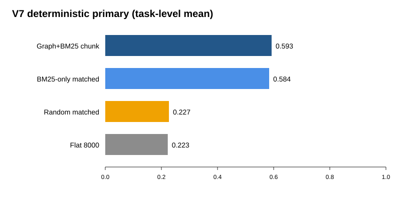

# V7 Routing-Sensitive Deterministic Evaluation

## Design and endpoint

The frozen formal panel contains 24 independent held-out tasks, four arms, and three generation replicates per task-arm cell (288 stored responses). Replicates were averaged within task before inference. The primary endpoint is the deterministic atomic-criterion score; the blinded LLM readability/actionability score is secondary.

## Primary results

| Arm | Task-level mean |
|---|---:|
| `graph_bm25_chunk_optimized` | 0.5926 |
| `full_corpus_bm25_token_matched` | 0.5839 |
| `random_token_matched` | 0.2268 |
| `flat_8000` | 0.2227 |

| Contrast | Mean difference | Exact P | Holm P | dz | 95% bootstrap CI |
|---|---:|---:|---:|---:|---:|
| optimized - `full_corpus_bm25_token_matched` | 0.0087 | 0.6719 | 0.6719 | 0.093 | [-0.0281, 0.0460] |
| optimized - `random_token_matched` | 0.3658 | 3.576e-07 | 7.153e-07 | 1.948 | [0.2908, 0.4371] |

## Decision

Routing superiority supported: **false**.

Optimized context reduction versus flat: 83.34%. Token-efficiency criterion supported: **true**.

Do not claim routing superiority. Preserve Outcome B; report the V7 null and only token-efficiency/governance claims that satisfy the retention and audit checks.

Claims remain bounded to this deterministic benchmark and its recorded evidence controls. No operational GxP compliance, human time savings, or regulatory outcome is claimed.
