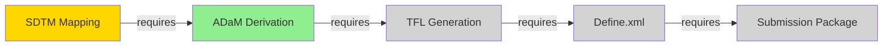

## Runtime Configuration (Step 0 — before any processing)

REQUIRED: Read these files to configure behavior:

1. **`ops/workflow-state.yaml`** — Current workflow state (check existence first)
2. **`graph/regulatory-graph.yaml`** — Regulatory task graph (via graph-router)
3. **`ops/derivation-manifest.md`** — Domain vocabulary (optional)

If no workflow state exists, suggest `/workflow init [template]` to start.

---

## EXECUTE NOW

**Target: $ARGUMENTS**

Parse command from arguments:
- `status` — Show current workflow state and progress
- `advance` — Attempt to advance to next stage
- `gates` — Show validation gate status
- `skills` — Show skills filtered by graph position (uses graph-router.py)
- `context` — Show full context for current position (uses context-loader.py)
- `graph` — Generate Mermaid visualization
- `next` — Show optimal next step with reasoning
- `init [id]` — Initialize workflow from template
- No arguments — Show quick status and offer commands

**START NOW.** Execute the appropriate command.

---

## Philosophy

**The workflow IS the graph. This skill makes it actionable.**

For statistical programming, the workflow graph encodes the entire regulatory pipeline from raw data to submission package. Every stage is a node, every dependency is a typed edge, and every validation gate is a quality checkpoint.

**Three capabilities:**
1. **Visibility** — Where am I? What's done? What's next?
2. **Enforcement** — Block invalid actions, ensure dependencies
3. **Routing** — Narrow skill search to relevant tools only (via graph-router)

---

## Commands

### /workflow status

Show current workflow state, progress. and history.

**Execution:**

```python
# Call graph-router for current position
import subprocess
import json

result = subprocess.run(
    ["python", "scripts/graph-router.py", "--current", "--json"],
    capture_output=True,
    text=True
)

if result.returncode == 0:
    data = json.loads(result.stdout)
    current_node = data.get("current_node", "unknown")
    layer = data.get("layer", 0)
    layer_name = data.get("layer_name", "Unknown")
else:
    # Fallback to direct state read
    with open("ops/workflow-state.yaml", "r") as f:
        state = yaml.safe_load(f)
    current_node = state.get("workflow", {}).get("current_stage", "unknown")
```

**Output:**

```
--=={ workflow status }==--

Workflow: Clinical Trial Statistical Programming Pipeline
Current Node: {CURRENT_NODE}
Layer: {LAYER} ({LAYER_NAME})

Graph Position:
  Predecessors: {PREDECESSOR_NODES}
  Current: {CURRENT_NODE}
  Successors: {SUCCESSOR_NODES}

Active Skills: {N} skills loaded
  /{skill}
  /{skill}
  ...

Context Reduction: 45 nodes -> {ADJACENT} adjacent
Run /workflow skills for full skill list.
Run /workflow advance to proceed.
```

---

### /workflow gates

Show validation gate status for current stage.

**Execution:**

```bash
# Get current stage ID
CURRENT_STAGE=$(grep "current_stage:" ops/workflow-state.yaml | awk '{print $2}')

# Read workflow definition
WORKFLOW_ID=$(grep "^  id:" ops/workflow-state.yaml | awk '{print $2}')
WORKFLOW_DEF=$(cat ops/workflows/${WORKFLOW_ID}.yaml)

# Extract gates for current stage
# (Use YAML parsing - yq if available, else grep)
GATES=$(extract_stage_gates "$CURRENT_STAGE" "$WORKFLOW_DEF")

# Get gate status from state file
for gate in GATES; do
  STATUS=$(get_gate_status "$gate.id")
  echo "- $gate.name: $STATUS"
done
```

**Output:**

```
--=={ workflow gates: {STAGE_NAME} }==--

Gate                    Status      Action    Last Run
─────────────────────────────────────────────────────────────────
{gate_name}              {status}    {action}  {last_run}
...

Summary:
  ✓ Passed:   {N}
  ✗ Failed:   {N} (blocking advance)
  ⏳ Pending: {N}
  ⚠ Warnings: {N}

{if FAILED > 0:}
⚠️ Cannot advance until blocking gates pass.
   Run the failed gates:
   - /{skill} for {gate_name}

{if ALL PASSED:}
✓ All gates passed. Run /workflow advance to proceed.
```

---

### /workflow skills

Show skills filtered by workflow position using graph-router.

**Execution:**

```python
import subprocess
import json

# Call graph-router for current node
result = subprocess.run(
    ["python", "scripts/graph-router.py", "--current", "--skills"],
    capture_output=True,
    text=True
)

print(result.stdout)

# For JSON output (programmatic use):
json_result = subprocess.run(
    ["python", "scripts/graph-router.py", "--current", "--json"],
    capture_output=True,
    text=True
)

data = json.loads(json_result.stdout)
skills = data.get("skills", [])
mcps = data.get("mcps", [])
```

**Output:**

```
--=={ workflow skills }==--

Current Node: {NODE_ID}
Layer: {LAYER} ({LAYER_NAME})

Graph Position:
  Predecessors: {PREDECESSOR_NODES}
  Current: {CURRENT_NODE}
  Successors: {SUCCESSOR_NODES}

Active Skills ({N}):
  /{skill}     — {brief description}
  /{skill}     — {brief description}
  ...

Active MCPs ({M}):
  {mcp}         — {brief description}
  ...

─────────────────────────────────────────────
Context reduction: 45 nodes -> {ADJACENT} adjacent
Skills loaded: {ACTIVE} of {TOTAL}

Run /workflow context to load full skill content.
```

---

### /workflow context

Show full context for current workflow position using context-loader.

**Execution:**

```python
import subprocess

# Call context-loader for current node
result = subprocess.run(
    ["python", "scripts/context-loader.py", "--current"],
    capture_output=True,
    text=True
)

print(result.stdout)

# For token estimate only:
estimate = subprocess.run(
    ["python", "scripts/context-loader.py", "--current", "--estimate"],
    capture_output=True,
    text=True
)
print(estimate.stdout)
```

**Output:**

```
--=={ context estimate: {NODE_ID} }==--

Layer {LAYER}: {LAYER_NAME}

Skills: {LOADED} loaded, {MISSING} missing
  Skill tokens:     ~{TOKENS}

Regulatory refs: {REF_COUNT}
  Reference tokens: ~{REF_TOKENS}

--------------------------------------------------
Total estimated: ~{TOTAL_TOKENS} tokens
Target:          < 5,000 tokens
Status:          OK / OVER TARGET
```

---

### /workflow graph

Generate Mermaid visualization.

**Execution:**

```bash
# Read workflow definition
WORKFLOW_ID=$(grep "^  id:" ops/workflow-state.yaml | awk '{print $2}')
WORKFLOW_DEF=$(cat ops/workflows/${WORKFLOW_ID}.yaml)

# Read current state for styling
STATE=$(cat ops/workflow-state.yaml)

# Build node styles based on status
STYLE_COMPLETED='fill:#90EE90'
STYLE_IN_PROGRESS='fill:#FFD700'
STYLE_BLOCKED='fill:#FF6B6B6B6'
STYLE_PENDING='fill:#D3D3D3'

# Generate Mermaid
echo "graph LR"
for stage in WORKFLOW_DEF.stages; do
  STATUS=$(get_stage_status "$stage.id")
  STYLE=$(get_style "$STATUS")
  echo "  $stage.id[\"$stage.name\"] $STYLE"
done

for dep in WORKFLOW_DEF.dependencies; do
  echo "  $dep.from -->|$dep.type| $dep.to"
done
echo ""
```

```

**Output:**

```
--=={ workflow graph }==--



Legend:
  🟡 Current Stage (In Progress)
  🟢 Completed
  🔴 Blocked
  ⚪ Pending
```

---

### /workflow next

Show optimal next step with reasoning.

**Purpose:** When multiple next steps are available, recommend the best one.

**Execution:**

```bash
# Get current stage
CURRENT_STAGE=$(grep "current_stage:" ops/workflow-state.yaml | awk '{print $2}')

# Read workflow definition
WORKFLOW_ID=$(grep "^  id:" ops/workflow-state.yaml | awk '{print $2}')
WORKFLOW_DEF=$(cat ops/workflows/${WORKFLOW_ID}.yaml)

# Find current stage info
STAGE=$(find_stage "$CURRENT_STAGE" "$WORKFLOW_DEF")

# Get next stages (unblocked by dependencies)
NEXT_stages=$(find_next_stages "$CURRENT_STAGE" "$WORKFLOW_DEF")

if no next stages available; then
  echo "No unblocked next stages available."
  echo "Current stage complete or exit 0
fi

# Rank next stages by priority
for stage in next_stages; do
  PRIORITY=$(calculate_stage_priority "$stage" "$STAGE")
  echo "- $stage.name: $stage.description (Priority: $PRIORITY/10)"
done

# Recommend best option
echo ""
Recommended: {best_option.name}
  Reason: {best_reason}
```

**Output:**

```
--=={ workflow next }==--

Current Stage: {STAGE_NAME}

Available Next Steps ({N}):
  1. {stage_name}
     Priority: HIGH
     Reason: {reason_1}
     ...
     {if N > 1:} Recommended: {stage_name}
     ({reason})

Run: /workflow advance to proceed with best option.
```

---

### /workflow advance

Attempt to advance to next stage.

**Execution:**

```bash
# Check validation gates
CURRENT_STAGE=$(grep "current_stage:" ops/workflow-state.yaml | awk '{print $2}')

# Get gate statuses
GATES=$(get_stage_gates "$CURRENT_STAGE")

# Check if all blocking gates pass
BLOCKING=$(grep -c "status: failed" GATES | grep -c "failure_action: block" || echo "0")

if [ "$BLOCKING" -gt 0 ]; then
  echo "ERROR: Cannot advance. Blocking gates failed."
  echo "Run /workflow gates to see details."
  exit 1
fi

# Check dependencies
DEPS=$(get_stage_dependencies "$CURRENT_STAGE")
INcomplete=$(check_dependencies "$deps")

if [ "$incomplete" -gt 0 ]; then
  echo "ERROR: Dependencies not complete:"
  for dep in incomplete; do
    echo "  - $dep"
  done
  echo "Complete dependencies before advancing."
  exit 1
fi

# Advance to next stage
NEXT_STAGE=$(get_next_stage "$CURRENT_STAGE")
update_state "$CURRENT_STAGE" "completed"
update_state "$NEXT_STAGE" "in_progress"
update_workflow_state "current_stage" "$NEXT_STAGE"
```

**Output:**

```
--=={ workflow advance }==--

Previous Stage: {OLD_STAGE}
  Status: completed
  Completed at: {timestamp}

New Stage: {NEW_STAGE}
  Status: in_progress
  Started: {timestamp}

Available Skills:
  /{skill}
  /{skill}
  ...

Validation Gates:
  {gate_name} — pending

Run /workflow gates to validate this stage.
```

---

### /workflow init [template-id]

Initialize a new workflow.

**Execution:**

```bash
# List available templates
if [ -z "$TEMPLATE_ID" ]; then
  echo "Available templates:"
  ls templates/workflows/*.yaml 2>/dev/null | xargs -I{} basename {} .yaml
  exit 0
fi

# Check if workflow already active
if [ -f "ops/workflow-state.yaml" ]; then
  CURRENT=$(grep "^  id:" ops/workflow-state.yaml | awk '{print $2}')
  echo "ERROR: Workflow already active: $CURRENT"
  echo "Remove ops/workflow-state.yaml to start fresh."
  exit 1
fi

# Copy template to ops/
cp "templates/workflows/${TEMPLATE_ID}.yaml" "ops/workflows/${TEMPLATE_ID}.yaml"

# Create state file
TIMESTAMP=$(date -u +"%Y-%m-%dT%H:%M:%SZ")
FIRST_STAGE=$(grep "^  - id:" "$TEMPLATE" | head -1 | awk '{print $2}')

cat <<EOF > ops/workflow-state.yaml
schema_version: 1
workflow:
  id: {TEMPLATE_ID}
  name: {TEMPLATE_NAME}
  current_stage: {FIRST_STAGE}
  started: "{TIMESTAMP}"

stages:
  # Initialize stages from template
  # First stage: in_progress
  # Others: pending or blocked based on dependencies
EOF

echo "Workflow initialized: {TEMPLATE_NAME}"
```

---

## Output Rules

- **Always show stage context** — Where is the user?
- **Always explain blocking** — Why can't advance?
- **Always suggest next action** — What should the user do?
- **Use domain vocabulary** — From derivation-manifest.md

- **Present Mermaid for** — For graph output
- **Show progress visually** — with progress bar or **Log transitions** — for future reference

- **Block gracefully** — on validation failures
- **Resume recovery exists** — from checkpoint files

- **Support resumability** — from saved state

---

## Edge Cases

### No Workflow Active

Suggest templates and available commands:
- Offer to run /workflow init [template]
- Do not block - guide user to initialize

- Use /workflow status for check current state

### Workflow Definition Missing

If state exists but definition missing:
- Error with clear message
- Suggest re-initializing with /workflow init

### All Stages Complete

Show completion summary
- Suggest archiving workflow state
- Offer to start new workflow

### Blocked Stage Transition

User must:
1. Review blocked gates
2. Fix issues
3. Re-run /workflow advance

---

## Integration Points

### With /ralph

Before processing any task, /ralph checks:
```python
import subprocess
import json

# Get current skills from graph-router
result = subprocess.run(
    ["python", "scripts/graph-router.py", "--current", "--json"],
    capture_output=True,
    text=True
)

data = json.loads(result.stdout)
allowed_skills = data.get("skills", [])

# Check if task's skill is allowed
if task_skill not in allowed_skills:
    print(f"BLOCKED: Task uses blocked skill: {task_skill}")
    print("Blocked reason: Skill not in current graph position")
    exit(1)

print(f"ALLOWED: Proceeding with task using {task_skill}")
```

### With /next

Add workflow signals:
```python
import subprocess
import json

# Check for workflow stage duration
result = subprocess.run(
    ["python", "scripts/graph-router.py", "--current", "--json"],
    capture_output=True,
    text=True
)

data = json.loads(result.stdout)

# Check for stage stall (in same position > 24h)
# Compare current_node vs state file timestamp
```

### With Hooks

**PostToolUse (Write):**
- If file matches stage output pattern → invalidate gates
- Update workflow state if needed

**SessionStart:**
- Inject workflow state into context via graph-router
- Show progress summary
- Surface relevant skills from current position

---

## Critical Constraints

**Never:**
- Allow skill execution outside of graph-routed skills (unless global)
- Advance stage with failing BLOCK gates
- Skip dependencies silently
- Modify state without logging
- Initialize workflow with circular dependencies

**Always:**
- Check workflow state at start (via graph-router)
- Validate gates before advance
- Log all transitions
- Explain blocking reasons
- Use domain vocabulary in output
